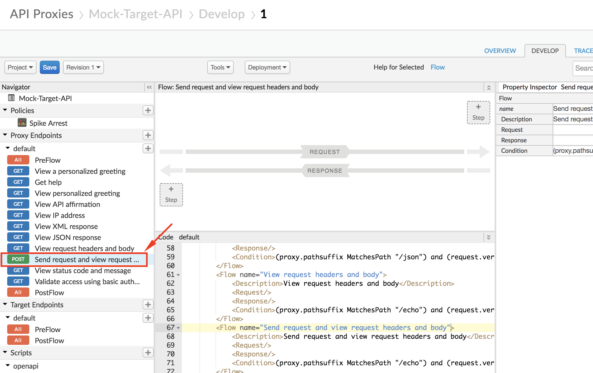

# Security : Threat Protection

*Duration : 15 mins*

*Persona : API Team / Security*

# Use case

You have an existing Apigee API proxy that takes requests from the Internet and forwards them to an existing service. You have a requirement to ensure the integrity of the API message content, by protecting against threats such as JSON/XML/SQL injection and other mallicious manipulation. 

# How can Apigee Edge help?

Message content is a significant attack vector used by malicious API consumers. Apigee Edge provides a set of out-of-the-box policies that help mitigate the potential for your backend services to be compromised by attackers or by malformed request payloads.

In this lab we will see how to use the following policies:
 - JSON Threat Protection policy
 - XML Threat Protection policy
 - Regular Expression Protection policy

# Pre-requisites

* Basic understanding of [JSON](https://www.json.org/) and [XML](https://www.w3.org/TR/2008/REC-xml-20081126) data formats.
* Completed a previous [Virtual API Jam](https://github.com/rmistry75/devjam3/tree/master/Labs/VirtualAPIJam) or have the equivalent knowledge of API lifecycle management, and specifically, API proxy policy configuration and enforcement on Apigee Edge.
* Completed [Lab 1 - Traffic Management](https://github.com/aliceinapiland/AdvancedVirtualAPIJam/tree/master/SecurityJam/Lab%201%20Traffic%20Management%20-%20Throttle%20APIs), of this Virtual API Jam on Security

# Instructions

## JSON Threat Protection

1. In your org, select **Develop → API Proxies** in the side navigation menu, and select the API proxy previously created in Lab 1.


2. Click on the **Develop** tab to access the API Proxy development dashboard.


3. Click on the "**Send request and view request headers and body**" flow under Proxy Endpoints default, and then click on **+Step** on the upper right of the Request flow to attach a JSON Threat Pretection policy.



4. Select **JSON Threat Protection** policy. Click on **Add** button to add the policy to the selected flow's request pipeline.


5. Select the policy to display the policy's XML configuration in the editor.


6. Change the policy's XML configuration to the below snippet to enforce protection against JSON payload manipulation threats.
```
<?xml version="1.0" encoding="UTF-8" standalone="yes"?>
<JSONThreatProtection async="false" continueOnError="false" enabled="true" name="JSON-Threat-Protection-1">
    <DisplayName>JSON Threat Protection-1</DisplayName>
    <Properties/>
    <ObjectEntryCount>5</ObjectEntryCount>
    <Source>request</Source>
</JSONThreatProtection>
```

In the above example, we use the JSON Threat Protection policy to ensure that the incoming API request JSON payload does not contain more than 5 fields. If the incoming payload contains more than 5 fields, the API proxy returns an error response.
For a full list of JSON integrity checks that can be performed using this policy, see the [JSON Threat Protection policy documentation](https://docs.apigee.com/api-platform/reference/policies/json-threat-protection-policy#elementreference).

7. Click on **Save** to save the API Proxy changes.


### To Test JSON Threat Protection:

1. To test the changes made, first click on **Trace** tab of the API proxy dashboard, and click on **Start Trace Session** button.


2. Now, send a POST request to the API endpoint **http://org-env.apigee.net/mock-target-api/echo** with the following format:
```
POST /mock-target-api/echo HTTP/1.1
Host: org-env.apigee.net
Content-Type: application/json

{
"field1": "test_value1",
"field2": "test_value2",
"field3": "test_value3",
"field4": "test_value4",
"field5": "test_value5",
"field6": "test_value6"
}
```

You can make this call either using a REST client like the one [here](https://apigee-rest-client.appspot.com/), or using a terminal command such as **curl**.
```
curl -X POST "http://org-env.apigee.net/mock-target-api/echo" -H "Content-Type: application/json" -d '{"field1": "test_value1", "field2": "test_value2", "field3": "test_value3", "field4": "test_value4", "field5": "test_value5", "field6": "test_value6"}'
```

3. The response received will be an error, since we attempted to send more than 5 fields in the POST request payload.


We also see that the JSON Threat Protection policy was triggered to return this error response, when we see the Trace screen.


4. You can now test for a successful API call, by sending the API endpoint a similar POST request, but this time with 5 or fewer fields in the JSON payload.
```
POST /mock-target-api/echo HTTP/1.1
Host: org-env.apigee.net
Content-Type: application/json

{
"field1": "test_value1",
"field2": "test_value2",
"field3": "test_value3",
"field4": "test_value4",
"field5": "test_value5"
}
```

You can make this call either using a REST client like the one [here](https://apigee-rest-client.appspot.com/), or using a terminal command such as **curl**.
```
curl -X POST "http://org-env.apigee.net/mock-target-api/echo" -H "Content-Type: application/json" -d '{"field1": "test_value1", "field2": "test_value2", "field3": "test_value3", "field4": "test_value4", "field5": "test_value5"}'
```

3. The response received will be a successful one, since we attempted to send fewer fields in the POST request payload.


We also see that the JSON Threat Protection policy allowed the request to go through and hit the API target, when we see the Trace screen.

