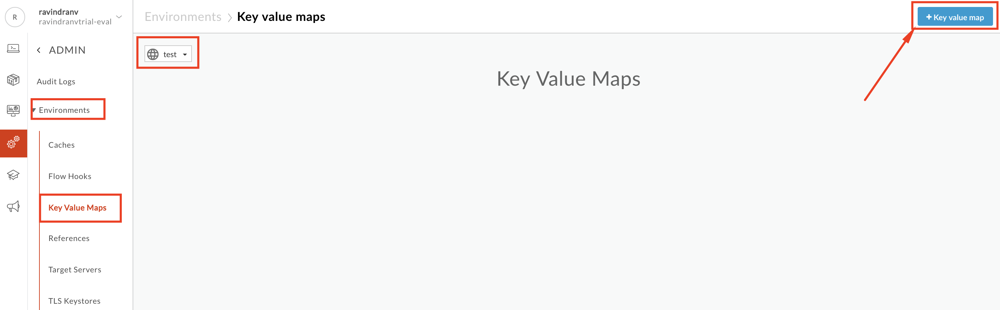
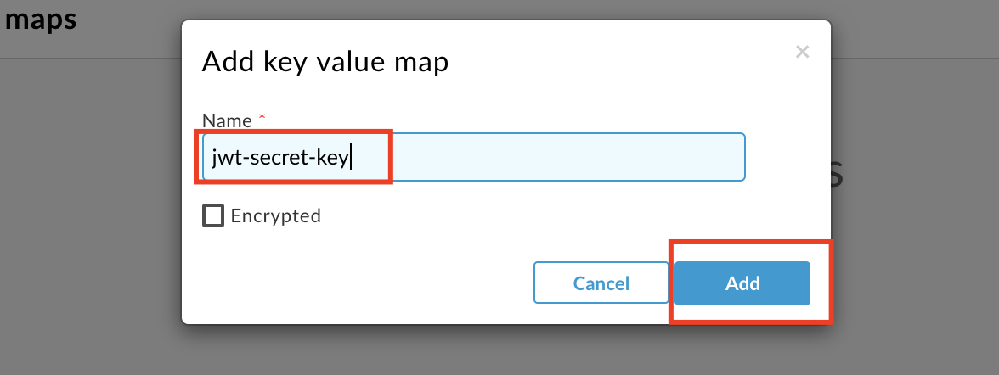

# **API Security : JWT**

*Duration : 15 mins*

*Persona : API Team/Security*

# **Use case**

You have an API that is consumed by third parties. You want to secure that API using JWT.

# **How can Apigee Edge help?**

[https://docs.apigee.com/api-platform/reference/policies/jwt-policies-overview](https://docs.apigee.com/api-platform/reference/policies/jwt-policies-overview)

# **Pre-requisites**

* You have completed [Lab 1](https://github.com/aliceinapiland/AdvancedVirtualAPIJam/tree/master/SecurityJam/Lab%201%20Traffic%20Management%20-%20Throttle%20APIs). If not, please complete that first.

# **Instructions**

* Go to [https://apigee.com/edge](https://apigee.com/edge) and log in. This is the Edge management UI.

* Select Admin → Environments in the side menu

* Select Key Value Maps tab, change Environment Configuration to "test’, and click **+Key Value Map**:

* Type "jwt-secret-key" (must be this name exactly) in the text box and click **Add**:

* Now that the key value map is created, add a Shared Secret (key: secret, value: Apigee123 or your choice) to it as shown:

* This shared secret will be used to both generate and verify JWT tokens using the HS256 algorithm.

* Go to Develop → Api Proxies:

* Click the **+Proxy** button on the top-right corner to invoke the Create Proxy wizard.

* Select **Proxy Bundle** and then click **Next** to import an existing proxy form a zip archive.

* Download the Apigee proxy "**JWT.zip**" that generates and verifies JWT’s [here](https://github.com/aliceinapiland/AdvancedVirtualAPIJam/blob/master/SecurityJam/Lab%204%20-%20JWT/JWT.zip?raw=true).  Then click "**Choose File**", select the “**JWT.zip**” file you just downloaded and click **Next**:

* Click **Build**.

* You should see a successful "Uploaded proxy" message..  Click on the link to the proxy at the bottom of the page.

* Deploy the JWT proxy by clicking on the **Deployment** dropdown and selecting the **test** environment.

* Click on the **Develop** tab.

* You can see that the JWT proxy has two proxy endpoints:  **/token** to generate a JWT, and **/verify** to verify a JWT.  Check both flows and read the XML policies to get a deeper understanding of how they work. (reference links available at the end of the lab)

* Start by turning on **Trace** for the JWT proxy.

* Then use the Apigee Rest Client: [https://apigee-rest-client.appspot.com/](https://apigee-rest-client.appspot.com/)

* POST to https://**{your-org-name}**-test.apigee.net/v1/jwt/token

* You should see a token received in HTTP response.  Copy the token value (except for the " “) and review the Trace tool to understand what happened.

* Go to [http://jwt.io](http://jwt.io) and paste the token in the Encoded Window (ensure the algorithm is HS256).  Also type the shared secret in the Verify Signature box:

* Now verify the token.  Use the same Apigee REST tool to do so

* POST to https://**{your-org-name}**-test.apigee.net/v1/jwt/verify

* In the Header, put "token" and its value

* If you get a 200 return code, the token is OK.

# **Lab Video**

# **Earn Extra-points**

Change the JWT token and claims (iss, aud, sub, extra claims) to see how the behavior changes.

# **Quiz**

# **Summary**

# **References**

* [Apigee Edge JWT token support explained in 4 minutes](https://youtu.be/mY5B6YlpkAY)

* [Apigee Edge JWT Policies Overview](https://docs.apigee.com/api-platform/reference/policies/jwt-policies-overview)

* [Adding Additional Claims to your JWT](https://docs.apigee.com/api-platform/reference/policies/generate-jwt-policy#additionalclaimsclaim)

Now go to [Lab 5](https://goo.gl/6S2iJr).